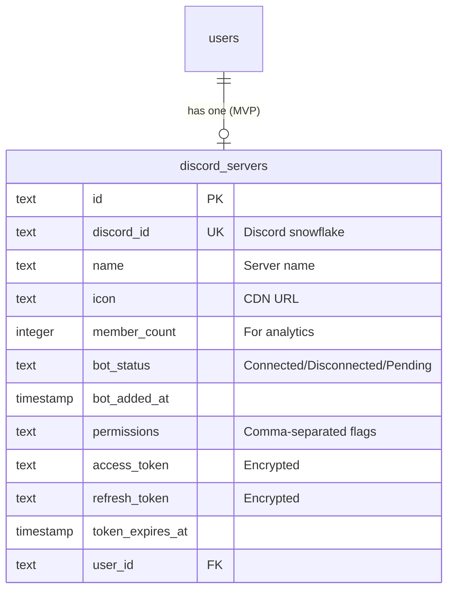
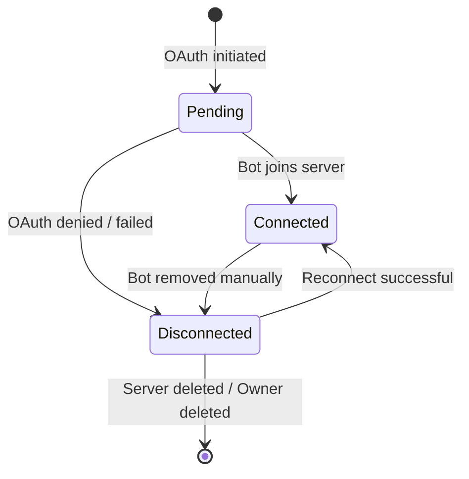

# Data Model: Discord Bot Invitation & Server Connection

**Feature**: 003-discord-bot-connection
**Date**: 2025-12-30
**Status**: Phase 1 Output

## Overview

This document defines the data model for Discord server connection management, including schema definitions, relationships, validation rules, and state transitions.

---

## Entity Relationship Diagram



---

## Tables

### discord_servers

Represents a Discord server connected to a server owner's account. MVP enforces one-to-one relationship with users.

| Column | Type | Constraints | Description |
|--------|------|-------------|-------------|
| `id` | TEXT | PRIMARY KEY | UUID v7 or similar unique identifier |
| `discord_id` | TEXT | UNIQUE, NOT NULL | Discord server snowflake ID (64-bit integer as string) |
| `name` | TEXT | NOT NULL | Server name from Discord API |
| `icon` | TEXT | NULLABLE | Server icon CDN URL (hash only, prepend `https://cdn.discordapp.com/icons/{discord_id}/{icon}.png`) |
| `member_count` | INTEGER | NOT NULL, DEFAULT 0 | Number of members for analytics (MVP max: 1,000) |
| `bot_status` | TEXT | NOT NULL, DEFAULT 'Pending' | Enum: `Connected`, `Disconnected`, `Pending` |
| `bot_added_at` | TIMESTAMP | NOT NULL | When bot was added to server |
| `permissions` | TEXT | NOT NULL | Comma-separated Discord permission flags (e.g., `8,1024,2048`) |
| `access_token` | TEXT | NOT NULL, ENCRYPTED | OAuth2 access token for Discord API |
| `refresh_token` | TEXT | NOT NULL, ENCRYPTED | OAuth2 refresh token for token refresh |
| `token_expires_at` | TIMESTAMP | NOT NULL | When access_token expires (typically ~7 days) |
| `user_id` | TEXT | FOREIGN KEY → users.id, UNIQUE | Owner of this server (MVP: one-to-one) |
| `created_at` | TIMESTAMP | NOT NULL, DEFAULT NOW() | Record creation timestamp |
| `updated_at` | TIMESTAMP | NOT NULL, DEFAULT NOW() | Last update timestamp |

### Drizzle Schema Definition

```typescript
// packages/db/src/schema/discord-servers.ts
import { relations } from "drizzle-orm";
import { text, integer, sqliteTable } from "drizzle-orm/sqlite-core";
import { users } from "./users";

export const discordServers = sqliteTable("discord_servers", {
  id: text("id").primaryKey(),
  discordId: text("discord_id").notNull().unique(),
  name: text("name").notNull(),
  icon: text("icon"),
  memberCount: integer("member_count").notNull().default(0),
  botStatus: text("bot_status", { enum: ["Connected", "Disconnected", "Pending"] })
    .notNull()
    .default("Pending"),
  botAddedAt: integer("bot_added_at", { mode: "timestamp" }).notNull(),
  permissions: text("permissions").notNull(), // Comma-separated flags
  accessToken: text("access_token").notNull(), // Store encrypted
  refreshToken: text("refresh_token").notNull(), // Store encrypted
  tokenExpiresAt: integer("token_expires_at", { mode: "timestamp" }).notNull(),
  userId: text("user_id")
    .notNull()
    .references(() => users.id)
    .unique(), // MVP: one-to-one
  createdAt: integer("created_at", { mode: "timestamp" })
    .notNull()
    .default(sql`(strftime('%s', 'now'))`),
  updatedAt: integer("updated_at", { mode: "timestamp" })
    .notNull()
    .default(sql`(strftime('%s', 'now'))`),
});

export const discordServersRelations = relations(discordServers, ({ one }) => ({
  user: one(users, {
    fields: [discordServers.userId],
    references: [users.id],
  }),
}));
```

---

## Relationships

### users ↔ discord_servers

| Relationship | Cardinality | Description |
|--------------|-------------|-------------|
| User owns Discord server | **1:1** (MVP) | Each user manages exactly one Discord server |

**Constraint Enforcement**:
- `discord_servers.user_id` has UNIQUE constraint
- Application-level check before creating new connection
- Error message: "Each account manages one Discord server. Contact support for multi-server management."

---

## State Transitions

### bot_status Lifecycle



#### State Descriptions

| State | Description | Entry Condition | Exit Condition |
|-------|-------------|------------------|----------------|
| `Pending` | OAuth flow initiated, awaiting callback | User clicks "Invite Bot" | Callback received → `Connected` or `Disconnected` |
| `Connected` | Bot is in server with valid permissions | Bot join confirmed | Bot removed from server OR permission downgrade |
| `Disconnected` | Bot not in server or insufficient permissions | Bot removed / permissions lost | Reconnect successful |

#### State Change Triggers

| Trigger | From | To | Action |
|---------|------|-----|--------|
| OAuth callback success | Pending | Connected | Store server info, verify bot presence |
| OAuth callback denied | Pending | Disconnected | Store error, show message to user |
| Bot detected in guild list | Disconnected | Connected | Update status, send notification |
| Bot missing from guild list | Connected | Disconnected | Update status, send email warning |
| Permission validation fails | Connected | Connected (warning) | Show warning in dashboard |

---

## Validation Rules

### Discord ID Validation

```typescript
// Discord snowflake: 64-bit integer as string
export function isValidDiscordId(id: string): boolean {
  // Snowflake format: numeric, 17-19 digits
  return /^\d{17,19}$/.test(id);
}
```

### Permission Flags Validation

```typescript
// Validate required permissions present
const REQUIRED_PERMISSIONS = [0x8, 0x400]; // MANAGE_ROLES, VIEW_CHANNEL

export function hasRequiredPermissions(permissions: string): boolean {
  const flags = permissions.split(",").map(Number);
  const permissionBitwise = flags.reduce((acc, flag) => acc | flag, 0);
  return REQUIRED_PERMISSIONS.every(req => (permissionBitwise & req) === req);
}
```

### Token Expiration Check

```typescript
export function isTokenExpired(expiresAt: Date): boolean {
  // Refresh 1 hour before actual expiration
  const refreshThreshold = new Date(expiresAt.getTime() - 60 * 60 * 1000);
  return new Date() > refreshThreshold;
}
```

---

## Encryption Requirements

### Token Storage

Access and refresh tokens MUST be encrypted at rest:

```typescript
// Use Cloudflare Workers' built-in encryption (AES-256-GCM)
import { encrypt, decrypt } from "worker-cloudflare-kv";

// Encrypt before storing
const encryptedAccessToken = await encrypt(accessToken, ENCRYPTION_KEY);

// Decrypt before using
const accessToken = await decrypt(encryptedAccessToken, ENCRYPTION_KEY);
```

**Note**: For MVP on D1 (which doesn't support encryption at rest), use:
- Application-level encryption before insert
- Decryption after select
- `ENCRYPTION_KEY` from environment variable

---

## Indexes

### Performance Indexes

```sql
-- Fast lookup by user_id (one-to-one relationship)
CREATE INDEX idx_discord_servers_user_id ON discord_servers(user_id);

-- Fast lookup by discord_id (Discord API callback)
CREATE INDEX idx_discord_servers_discord_id ON discord_servers(discord_id);

-- Status filtering for dashboard queries
CREATE INDEX idx_discord_servers_bot_status ON discord_servers(bot_status);

-- Token expiration monitoring (cron job)
CREATE INDEX idx_discord_servers_token_expires_at ON discord_servers(token_expires_at);
```

---

## Migration Plan

### New Table: discord_servers

```sql
-- Migration: 0002_create_discord_servers.sql
CREATE TABLE discord_servers (
  id TEXT PRIMARY KEY,
  discord_id TEXT NOT NULL UNIQUE,
  name TEXT NOT NULL,
  icon TEXT,
  member_count INTEGER NOT NULL DEFAULT 0,
  bot_status TEXT NOT NULL DEFAULT 'Pending' CHECK(bot_status IN ('Connected', 'Disconnected', 'Pending')),
  bot_added_at INTEGER NOT NULL,
  permissions TEXT NOT NULL,
  access_token TEXT NOT NULL,
  refresh_token TEXT NOT NULL,
  token_expires_at INTEGER NOT NULL,
  user_id TEXT NOT NULL UNIQUE REFERENCES users(id),
  created_at INTEGER NOT NULL,
  updated_at INTEGER NOT NULL
);

CREATE INDEX idx_discord_servers_user_id ON discord_servers(user_id);
CREATE INDEX idx_discord_servers_discord_id ON discord_servers(discord_id);
CREATE INDEX idx_discord_servers_bot_status ON discord_servers(bot_status);
CREATE INDEX idx_discord_servers_token_expires_at ON discord_servers(token_expires_at);
```

### Update: users Table

No changes required to `users` table. The existing `discordId` column represents the user's Discord account (for their OAuth login), separate from the `discord_servers` table which represents servers they manage.

---

## Data Access Patterns

### Create Discord Server (OAuth Callback)

```typescript
async function createDiscordServer(data: {
  userId: string;
  discordId: string;
  name: string;
  icon: string | null;
  memberCount: number;
  permissions: string;
  accessToken: string;
  refreshToken: string;
}) {
  // Check user doesn't already have a server (MVP constraint)
  const existing = await db.query.discordServers.findFirst({
    where: eq(discordServers.userId, data.userId)
  });
  if (existing) {
    throw new Error("Each account manages one Discord server.");
  }

  // Check discord_id not already connected to another user
  const existingDiscord = await db.query.discordServers.findFirst({
    where: eq(discordServers.discordId, data.discordId)
  });
  if (existingDiscord) {
    throw new Error("This Discord server is already connected to another account.");
  }

  const tokenExpiresAt = new Date(Date.now() + 7 * 24 * 60 * 60 * 1000); // ~7 days

  const [server] = await db.insert(discordServers).values({
    id: crypto.randomUUID(),
    ...data,
    botStatus: "Connected",
    botAddedAt: new Date(),
    tokenExpiresAt,
    createdAt: new Date(),
    updatedAt: new Date(),
  }).returning();

  return server;
}
```

### Update Bot Status

```typescript
async function updateBotStatus(serverId: string, status: "Connected" | "Disconnected") {
  await db.update(discordServers)
    .set({ botStatus: status, updatedAt: new Date() })
    .where(eq(discordServers.id, serverId));
}
```

### Refresh Token

```typescript
async function refreshAccessToken(serverId: string) {
  const server = await db.query.discordServers.findFirst({
    where: eq(discordServers.id, serverId)
  });

  if (!server) throw new Error("Server not found");

  const newTokens = await discord.refreshAccessToken(server.refreshToken);

  const tokenExpiresAt = newTokens.accessTokenExpiresAt();
  await db.update(discordServers)
    .set({
      accessToken: newTokens.accessToken(),
      refreshToken: newTokens.refreshToken,
      tokenExpiresAt,
      updatedAt: new Date(),
    })
    .where(eq(discordServers.id, serverId));

  return newTokens.accessToken();
}
```

---

## Summary

| Entity | Table | Rows (MVP) | Relationships |
|--------|-------|------------|---------------|
| DiscordServer | discord_servers | ≤ 100 | BelongsTo: users |

**Status**: Ready for implementation. Database migration and Drizzle schema can be generated from this specification.
